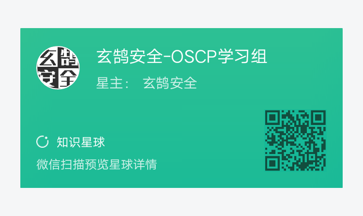

# Oscp公益学习组（持续更新中……）
## 一、学习组简介
希望提供建立公益学习组帮助大家汇总学习资源、分享学习经验。
## 二、学习资源整理

[0x0000-小技巧合集.md](https://github.com/xuanhusec/OscpStudyGroup/blob/master/0x0000-%E5%B0%8F%E6%8A%80%E5%B7%A7%E5%90%88%E9%9B%86.md)

[0x0001-Kali基本操作.md](https://github.com/xuanhusec/OscpStudyGroup/blob/master/0x0001-Kali%E5%9F%BA%E6%9C%AC%E6%93%8D%E4%BD%9C.md)

[0x0002-常用工具.md](https://github.com/xuanhusec/OscpStudyGroup/blob/master/0x0002-%E5%B8%B8%E7%94%A8%E5%B7%A5%E5%85%B7.md)

[0x0003-windows提权汇总.md](https://github.com/xuanhusec/OscpStudyGroup/blob/master/0x0003-windows%E6%8F%90%E6%9D%83%E6%B1%87%E6%80%BB.md)

[0x0004-反弹shell方法汇总.md](https://github.com/xuanhusec/OscpStudyGroup/blob/master/0x0004-%E5%8F%8D%E5%BC%B9shell%E6%96%B9%E6%B3%95%E6%B1%87%E6%80%BB.md)

[0x0005-靶机推荐列表.xlsx](https://github.com/xuanhusec/OscpStudyGroup/blob/master/0x0005-%E9%9D%B6%E6%9C%BA%E6%8E%A8%E8%8D%90%E5%88%97%E8%A1%A8.xlsx)

[0x0006-考试报告模板.doc](https://github.com/xuanhusec/OscpStudyGroup/blob/master/0x0006-%E8%80%83%E8%AF%95%E6%8A%A5%E5%91%8A%E6%A8%A1%E6%9D%BF.doc)

## 三、其他资源参考
**0、OSCP命令大全**：https://github.com/Elinpf/OSCP-survival-guide

**1、反弹shell方法汇总**：http://pentestmonkey.net/cheat-sheet/shells/reverse-shell-cheat-sheet

**2、linux提权方法汇总**：https://blog.g0tmi1k.com/2011/08/basic-linux-privilege-escalation/

**3、windows提权方法汇总1**：https://www.fuzzysecurity.com/tutorials/16.html

**4、windows提权方法汇总2**：https://github.com/netbiosX/Checklists/blob/master/Windows-Privilege-Escalation.md

**5、Linux提权辅助脚本1**：https://www.securitysift.com/download/linuxprivchecker.py

**6、linux提权辅助脚本2**：https://github.com/diego-treitos/linux-smart-enumeration

**7、Windows提权辅助脚本**：https://github.com/pentestmonkey/windows-privesc-check

**8、Windows提权辅助辅助工具**：https://github.com/bitsadmin/wesng

**9、oscp备考解读**：https://www.aqniukt.com/course/13464

## 四、与我交流

我的微信

团队公众号

更多优质资源可加入星球学习

